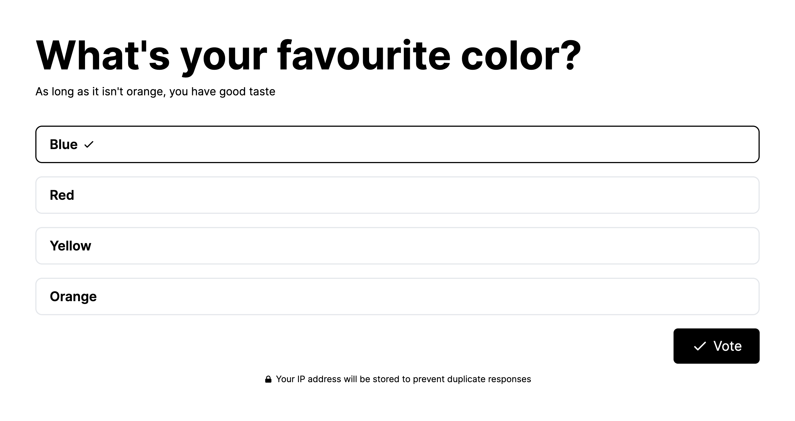
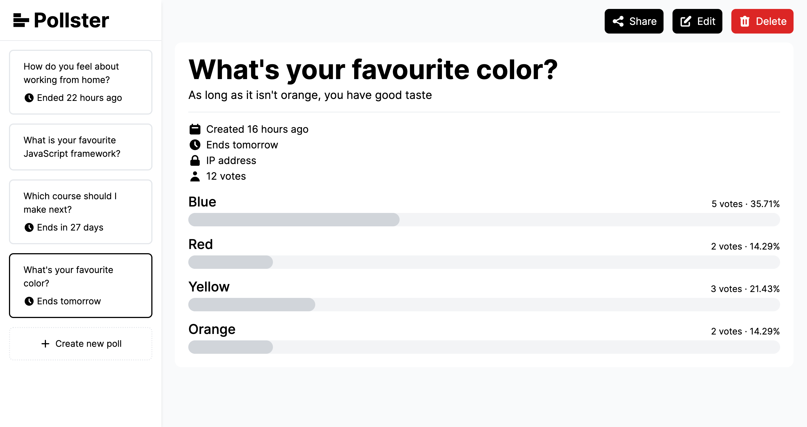

  
Deta Shipathon 2023 🏆 Best App

  

  <h1 align="center">Pollster</h1>

  

    Make every voice count, with polls that matter.
  

  

   
  
  
   
   

## About

Pollster is an easy-to-use web app that allows you to create polls for any purpose and gather opinions in no time. This project was built during the [2023 Deta Shipathon](https://deta.space/blog/sprint-to-space).

- Create a poll and share it with your participants in less than a minute

- Add as many options as you want and share it with unlimited participants

- Each poll has dynamically generated social images and custom URLs

## License

Distributed under the MIT License. See [`LICENSE`](LICENSE) for more information.

For any queries, contact [pollster@aarush.dev](mailto:pollster@aarush.dev)
